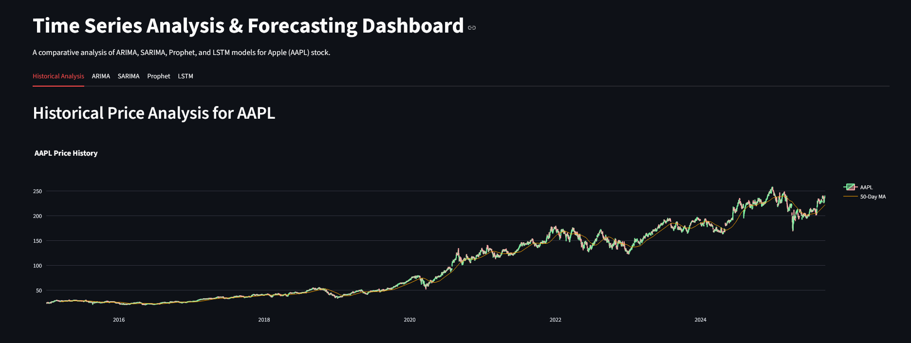

# Time Series Forecasting for AAPL (Apple Stock Prices) 📈


An end-to-end data science project focused on analyzing and forecasting Apple (AAPL) stock prices using a variety of time series models, presented in an interactive web dashboard. Created by Umesh K.

---

## 🚀 Live Demo

[](https://timeseriesanalysisaapl.streamlit.app/)

---

## 📊 Dashboard Preview



---

## ✨ Key Features

- **Historical Analysis**: Interactive candlestick charts to explore historical price, volume, and moving averages.
- **Multi-Model Forecasting**: Implements and compares four different forecasting models: ARIMA, SARIMA, Prophet, and a Deep Learning LSTM network.
- **Pre-computed Workflow**: A professional two-script setup where models are trained offline for a fast and responsive user-facing dashboard.
- **Interactive Dashboard**: A fully interactive web app built with Streamlit to visualize and compare model performance.

---

## 🛠️ Tech Stack & Libraries

- **Language**: Python
- **Data Handling**: pandas, numpy
- **Data Sourcing**: yfinance
- **Forecasting Models**: statsmodels (ARIMA, SARIMA), prophet (by Meta), tensorflow (LSTM)
- **Visualization & Dashboard**: Streamlit, plotly
- **Version Control & Deployment**: Git, GitHub, Streamlit Community Cloud

---

## ⚙️ Setup and Installation

To run this project locally, please follow these steps:

1.  **Clone the repository:**
    ```bash
    git clone https://github.com/mercuryafk/TimeSeriesAnalysis.git
    cd TimeSeriesAnalysis
    ```

2.  **Create and activate a virtual environment:**
    ```bash
    python -m venv venv
    source venv/bin/activate  # On Windows, use `venv\Scripts\activate`
    ```

3.  **Install the required libraries:**
    ```bash
    pip install -r requirements.txt
    ```

---

## 🚀 How to Run

This project uses a two-step workflow to ensure the dashboard is fast.

1.  **Run the offline computation script first**: This will train all the models and generate the forecast CSV files. This step is slow and only needs to be run once.
    ```bash
    python runmodelsoffline.py
    ```

2.  **Run the Streamlit dashboard**: This will start the web app, which loads the pre-computed data. This step is fast.
    ```bash
    streamlit run dashboard.py
    ```

---

## 💡 Model Findings & Comparison

This project's core is the comparison of different modeling approaches. Each model revealed different strengths and weaknesses.

| Model | Key Characteristics | Performance Notes |
| :--- | :--- | :--- |
| **ARIMA** | Statistical baseline, models autocorrelation. | Produced a stable, linear forecast. Serves as a great benchmark but misses non-linear patterns. |
| **SARIMA** | Extends ARIMA with seasonal components. | Forecast was similar to ARIMA, indicating weak quarterly seasonality in the stock data. Computationally expensive. |
| **Prophet** | Automated, decomposable model. | Excellent for providing insights into yearly and weekly patterns, but the overall forecast was similar to the trend. |
| **LSTM** | Deep learning neural network. | **Most accurate model in back-testing (RMSE ≈ $6.71)**. Excelled at capturing complex, non-linear price movements. Long-range forecasts were unstable, highlighting its limitation. |

### Conclusion
The **LSTM** model provided the most accurate short-term predictions on unseen test data. However, **Prophet** was invaluable for its ability to decompose the time series and provide human-readable insights. The choice of the "best" model depends on the specific goal: raw accuracy (LSTM) vs. interpretability (Prophet).
